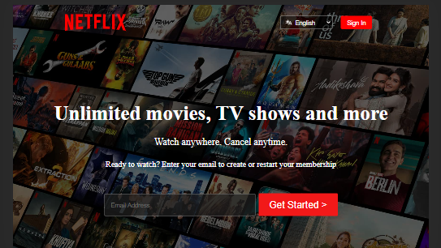

# Netflix Clone 

## Overview

This project is a clone of the Netflix interface, built using HTML5 and CSS3 for frontend design practice.

## Features

- **Responsive Design**: Ensures compatibility across various devices and screen sizes.
- **CSS Flexbox**: Utilizes Flexbox for layout management, ensuring a dynamic and fluid UI.
- **HTML Structure**: Follows semantic HTML5 markup for better accessibility and SEO.
- **Custom Styles**: Custom CSS to mimic Netflix's look and feel, including navigation, grid layout for movie thumbnails, and modal overlays.
- **Live Website**: [Visit the Facebook Clone Live](https://aurora24.netlify.app/)

## Project Structure

The project directory structure is as follows:

```
Netflix/
│
├── index.html        # Main HTML file for Netflix clone
├── style.css    # CSS file for styling
│  
├── Assets/           # Directory for storing images
│   └── (image & video files)
└── README.md         # This file, providing project details
```




